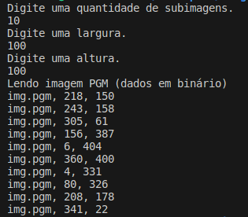
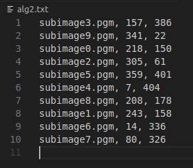

# Image Region Search

## Visão Geral

O Image Region Search é um projeto desenvolvido como trabalho final da disciplina de Laboratório de Programação, ministrada pelo professor Daniel Ferreira. O objetivo principal deste projeto é criar uma aplicação capaz de salvar subimagens filtradas de uma imagem em escalas de cinza e localizar a posição dessas subimagens na imagem original por meio do algoritmo de correlação cruzada.

## Estrutura do Projeto

O projeto está organizado da seguinte forma:

- **Makefile:** O arquivo Makefile contém as instruções para compilar e construir o projeto.
- **lib:** Esta pasta contém os cabeçalhos necessários para compilar o projeto.
- **main.c:** O arquivo main.c é usado para testar o projeto e executar as funcionalidades implementadas.
- **funcs.c:** Este arquivo contém as funções principais responsáveis pela lógica do projeto.
- **utils.c:** Aqui estão implementadas as funções matemáticas necessárias para o funcionamento do algoritmo.
- **pgm.c:** O arquivo pgm.c contém funções para lidar com imagens em escala de cinza.

## Algoritmos Principais

O projeto inclui dois algoritmos principais:

1. **alg1:** Este algoritmo é responsável por salvar subimagens filtradas a partir de uma imagem em escalas de cinza.
2. **alg2:** Este algoritmo realiza o processo inverso do algoritmo anterior, localizando na imagem a posição de uma subimagem filtrada por meio do algoritmo de correlação cruzada.

## Como Utilizar

Para utilizar o projeto, siga estas etapas:

1. Compile o projeto utilizando o Makefile.
2. Execute o arquivo gerado para testar as funcionalidades implementadas.
3. Siga as instruções apresentadas no console para interagir com o projeto.

## Precisão

A quinta imagem da pasta outros (img04_ORIGINAL.pgm) foi utilizada no alg1.

Essas foram as posições adquiridas:

Esses foram os resultados do alg2 para essas subimagens:

Note que as posições dos resultados estão inseridas em ordem aleatória.

Precisão Média: **98.94%**

## Contribuindo

Contribuições são bem-vindas! Sinta-se à vontade para abrir uma issue ou enviar um pull request com melhorias ou novas funcionalidades.

## Licença

Este projeto está licenciado sob a [MIT License](LICENSE).
